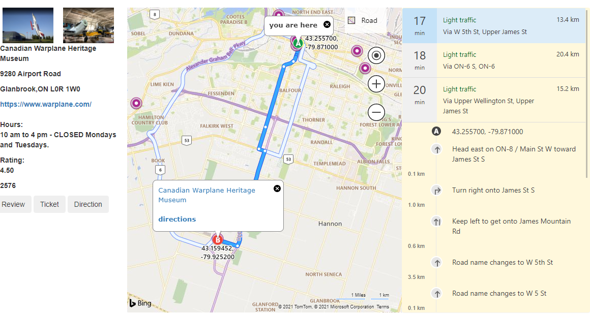
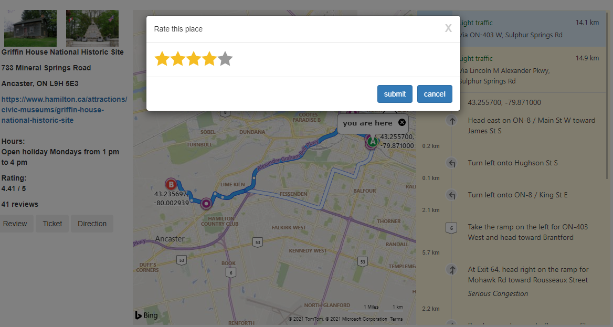

# Bing Map Web App 

##### backend functions finished -- frontend performance under developing

*Created Bing Map based web application using HTML, CSS, BootStrap, JavaScript, JQuery, PHP, and SQL
*Built in the ability for users to browse Hamilton’s Museums and Galleries’ information on Bing Map including images, address, hours, reviews, and admission rates.
*Built in the ability for users to rate the museum or gallery, purchase tickets, and get direction on Bing Map.
*Stored and kept tracking user data through the database

